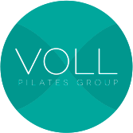

<h1 align="center">
  Teste para estagio na Voll Pilates
</h1>
<h1 align="center"> 
 
</h1>

  <a href="#-tecnologias">Tecnologias</a>&nbsp;&nbsp;&nbsp;|&nbsp;&nbsp;&nbsp;
  <a href="#-projeto">Projeto</a>&nbsp;&nbsp;&nbsp;|&nbsp;&nbsp;&nbsp;
  <a href="#-layout">Layout</a>&nbsp;&nbsp;&nbsp;

 

## 🚀 Tecnologias

Esse projeto foi desenvolvido com as seguintes tecnologias:

- [HTML5](https://developer.mozilla.org/pt-BR/docs/Learn/Getting_started_with_the_web/HTML_basics)
- [CSS3](https://developer.mozilla.org/pt-BR/docs/Web/CSS)
- [JavaScript](https://www.javascript.com/)
- [Bootstrap 5](https://getbootstrap.com/)

## 💻 Projeto

Trata-se de uma landing page que redireciona o usuário para a página da Voll Pilates após 15 segundos.

## 🔖 Layout

Abaixo você encontra o layout do projeto web. 

  

## 🧠 Desafio

- Criar uma página a partir do layout em jpg. 
- Implementar em HTML/CSS usando bootstrat, css grid ou flexbox ou então usando Wordpress.
- Criar links para https://grupovoll.com.br nos textos abaixo das
imagens(fotos) para abrir em outra aba.
- Criar um redirect automático para o https://vollpilates.com.br após 15 segundos – usar Javascript para isso.

## :memo: Github Pages

Esse projeto está no Github Pages.

https://guismartins.github.io/teste-estagio/

---

  Feito com ♥ by Guilherme Martins</a>

